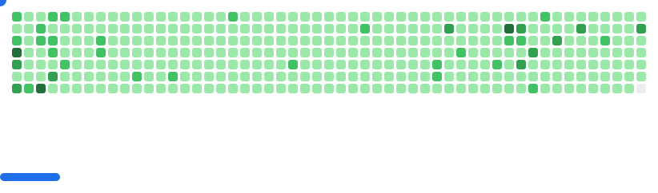

    <h1>Привет!  Меня зовут Михаил Белый</h1>

    Я занимаюсь Android-разработкой с 2015 года. Пишу на котлине, не забыл джаву. Сейчас изучаю мультиплатформу. Меня вдохновляют проекты, в которых следят за дизайном и стремятся к улучшению пользовательского опыта.

     <!-- source: https://github.com/anmol-baranwal/cool-gifs-for-github -->

<h2 align="center">
    Скиллы
</h2>

 
[![Material3](https://img.shields.io/badge/Material3-004A76?&style=for-the-badge&logo=data:image/svg+xml;base64,PHN2ZyB4bWxucz0iaHR0cDovL3d3dy53My5vcmcvMjAwMC9zdmciIHdpZHRoPSI4MDBweCIgaGVpZ2h0PSI4MDBweCIgdmlld0JveD0iMCAwIDI0IDI0Ij4KICA8dGl0bGU+bWF0ZXJpYWxfZGVzaWduPC90aXRsZT4KICA8cmVjdCB3aWR0aD0iMjQiIGhlaWdodD0iMjQiIGZpbGw9Im5vbmUiLz4KICA8cGF0aCBkPSJNMjEsMTJhOSw5LDAsMCwwLTItNS42MlYxNy42M0E4Ljc4LDguNzgsMCwwLDAsMjEsMTJtLTMuMzcsN0g2LjM4YTkuNSw5LjUsMCwwLDAsMi42NywxLjQxQTguOTEsOC45MSwwLDAsMCwxMiwyMSw4Ljg2LDguODYsMCwwLDAsMTUsMjAuNDEsOS43Miw5LjcyLDAsMCwwLDE3LjYzLDE5TTExLDE3LDcsOXY4aDRtNi04LTQsOGg0VjltLTUsNS41M0wxNS43NSw3SDguMjVMMTIsMTQuNTNNMTcuNjMsNUE4LjkxLDguOTEsMCwwLDAsNi4zOCw1SDE3LjYzTTUsMTcuNjNWNi4zOEE5LDksMCwwLDAsMywxMmE4Ljc4LDguNzgsMCwwLDAsMiw1LjYzTTIzLDEyYTEwLjU3LDEwLjU3LDAsMCwxLTMuMjIsNy43OEExMC41NywxMC41NywwLDAsMSwxMiwyM2ExMC41OSwxMC41OSwwLDAsMS03Ljc4LTMuMjJBMTAuNTcsMTAuNTcsMCwwLDEsMSwxMiwxMC41OSwxMC41OSwwLDAsMSw0LjIyLDQuMjIsMTAuNTksMTAuNTksMCwwLDEsMTIsMWExMC41NywxMC41NywwLDAsMSw3Ljc4LDMuMjJBMTAuNTksMTAuNTksMCwwLDEsMjMsMTJaIiBmaWxsPSIjZmZmZmZmIi8+Cjwvc3ZnPg==&logoColor=white)](https://m3.material.io)

[![Cursor](https://img.shields.io/badge/Cursor-2F2F2F?&style=for-the-badge&logo=data:image/svg+xml;base64,PHN2ZyB3aWR0aD0iNzUiIGhlaWdodD0iODUiIHZpZXdCb3g9IjAgMCA3NSA4NSIgZmlsbD0ibm9uZSIgeG1sbnM9Imh0dHA6Ly93d3cudzMub3JnLzIwMDAvc3ZnIj4KPHBhdGggZD0iTTczLjUwNCAyMC4xMTg4TDM5LjI3NTYgMC40NzMyNDdDMzguMTc2NSAtMC4xNTc3NDkgMzYuODIwMyAtMC4xNTc3NDkgMzUuNzIxMiAwLjQ3MzI0N0wxLjQ5NDQxIDIwLjExODhDMC41NzA0NDYgMjAuNjQ5MiAwIDIxLjYzIDAgMjIuNjkyM1Y2Mi4zMDc3QzAgNjMuMzcgMC41NzA0NDYgNjQuMzUwOCAxLjQ5NDQxIDY0Ljg4MTJMMzUuNzIyOCA4NC41MjY3QzM2LjgyMTkgODUuMTU3NyAzOC4xNzgxIDg1LjE1NzcgMzkuMjc3MiA4NC41MjY3TDczLjUwNTYgNjQuODgxMkM3NC40Mjk2IDY0LjM1MDggNzUgNjMuMzcgNzUgNjIuMzA3N1YyMi42OTIzQzc1IDIxLjYzIDc0LjQyOTYgMjAuNjQ5MiA3My41MDU2IDIwLjExODhINzMuNTA0Wk03MS4zNTQgMjQuMjgwMkwzOC4zMTE1IDgxLjE3NTNDMzguMDg4MSA4MS41NTg3IDM3LjQ5ODQgODEuNDAyMSAzNy40OTg0IDgwLjk1OFY0My43MDM3QzM3LjQ5ODQgNDIuOTU5MyAzNy4wOTgzIDQyLjI3MDggMzYuNDQ5MSA0MS44OTdMMy45OTYzNCAyMy4yNzA2QzMuNjEwNjggMjMuMDQ4NSAzLjc2ODE2IDIyLjQ2MjMgNC4yMTQ4NyAyMi40NjIzSDcwLjI5OThDNzEuMjM4MyAyMi40NjIzIDcxLjgyNDggMjMuNDczNSA3MS4zNTU2IDI0LjI4MThINzEuMzU0VjI0LjI4MDJaIiBmaWxsPSJ3aGl0ZSIvPgo8L3N2Zz4K)](https://cursor.com)

<h2 align="center">
    Контакты
</h2>

[![](https://img.shields.io/badge/Telegram-24A1DE?&style=for-the-badge&logo=data:image/svg+xml;base64,PHN2ZyB3aWR0aD0iNDciIGhlaWdodD0iMzkiIHZpZXdCb3g9IjAgMCA0NyAzOSIgZmlsbD0ibm9uZSIgeG1sbnM9Imh0dHA6Ly93d3cudzMub3JnLzIwMDAvc3ZnIj4KPHBhdGggZmlsbC1ydWxlPSJldmVub2RkIiBjbGlwLXJ1bGU9ImV2ZW5vZGQiIGQ9Ik0zLjE3MjkyIDE2LjQ2NjRDMTUuNTYyNSAxMS4wNjg0IDIzLjgyNDIgNy41MDk3NSAyNy45NTggNS43OTAzOEMzOS43NjA3IDAuODgxMjMxIDQyLjIxMzIgMC4wMjg0NTkzIDQzLjgxMTcgMC4wMDAzMDAyMzhDNDQuMTYzMiAtMC4wMDU4OTMwMyA0NC45NDkzIDAuMDgxMjM3OSA0NS40NTg1IDAuNDk0NDJDNDUuODg4NSAwLjg0MzMwMyA0Ni4wMDY4IDEuMzE0NTkgNDYuMDYzNCAxLjY0NTM3QzQ2LjEyIDEuOTc2MTUgNDYuMTkwNSAyLjcyOTY4IDQ2LjEzNDUgMy4zMTg0NkM0NS40OTQ5IDEwLjAzODcgNDIuNzI3NCAyNi4zNDcgNDEuMzE5NCAzMy44NzM4QzQwLjcyMzcgMzcuMDU4NyAzOS41NTA2IDM4LjEyNjUgMzguNDE1IDM4LjIzMUMzNS45NDY5IDM4LjQ1ODIgMzQuMDcyOCAzNi42IDMxLjY4MjMgMzUuMDMzQzI3Ljk0MTggMzIuNTgxIDI1LjgyODYgMzEuMDU0NyAyMi4xOTc4IDI4LjY2MkMxOC4wMDE3IDI1Ljg5NjggMjAuNzIxOCAyNC4zNzcxIDIzLjExMzIgMjEuODkzM0MyMy43MzkgMjEuMjQzMyAzNC42MTMzIDExLjM1MjMgMzQuODIzOCAxMC40NTVDMzQuODUwMSAxMC4zNDI4IDM0Ljg3NDUgOS45MjQ1MSAzNC42MjYgOS43MDM2NEMzNC4zNzc1IDkuNDgyNzYgMzQuMDEwNyA5LjU1ODI5IDMzLjc0NjEgOS42MTgzNkMzMy4zNzA5IDkuNzAzNTEgMjcuMzk1MyAxMy42NTMxIDE1LjgxOTMgMjEuNDY3M0MxNC4xMjMyIDIyLjYzMiAxMi41ODY4IDIzLjE5OTUgMTEuMjEwNCAyMy4xNjk3QzkuNjkyODkgMjMuMTM2OSA2Ljc3Mzg4IDIyLjMxMTcgNC42MDM5MSAyMS42MDY0QzEuOTQyMzQgMjAuNzQxMiAtMC4xNzMwMTkgMjAuMjgzOCAwLjAxMTE4MTUgMTguODE0NEMwLjEwNzEyNCAxOC4wNDkxIDEuMTYxMDQgMTcuMjY2NCAzLjE3MjkyIDE2LjQ2NjRaIiBmaWxsPSJ3aGl0ZSIvPgo8L3N2Zz4K)](https://t.me/michaelbel)

 

<h2 align="center">
    Новости
</h2>

    Подписывайся на мой базированный telegram-канал про Android-разработку: 

 

[![](https://img.shields.io/badge/Подписаться-24A1DE?&style=for-the-badge&logo=data:image/svg+xml;base64,PHN2ZyB3aWR0aD0iNDciIGhlaWdodD0iMzkiIHZpZXdCb3g9IjAgMCA0NyAzOSIgZmlsbD0ibm9uZSIgeG1sbnM9Imh0dHA6Ly93d3cudzMub3JnLzIwMDAvc3ZnIj4KPHBhdGggZmlsbC1ydWxlPSJldmVub2RkIiBjbGlwLXJ1bGU9ImV2ZW5vZGQiIGQ9Ik0zLjE3MjkyIDE2LjQ2NjRDMTUuNTYyNSAxMS4wNjg0IDIzLjgyNDIgNy41MDk3NSAyNy45NTggNS43OTAzOEMzOS43NjA3IDAuODgxMjMxIDQyLjIxMzIgMC4wMjg0NTkzIDQzLjgxMTcgMC4wMDAzMDAyMzhDNDQuMTYzMiAtMC4wMDU4OTMwMyA0NC45NDkzIDAuMDgxMjM3OSA0NS40NTg1IDAuNDk0NDJDNDUuODg4NSAwLjg0MzMwMyA0Ni4wMDY4IDEuMzE0NTkgNDYuMDYzNCAxLjY0NTM3QzQ2LjEyIDEuOTc2MTUgNDYuMTkwNSAyLjcyOTY4IDQ2LjEzNDUgMy4zMTg0NkM0NS40OTQ5IDEwLjAzODcgNDIuNzI3NCAyNi4zNDcgNDEuMzE5NCAzMy44NzM4QzQwLjcyMzcgMzcuMDU4NyAzOS41NTA2IDM4LjEyNjUgMzguNDE1IDM4LjIzMUMzNS45NDY5IDM4LjQ1ODIgMzQuMDcyOCAzNi42IDMxLjY4MjMgMzUuMDMzQzI3Ljk0MTggMzIuNTgxIDI1LjgyODYgMzEuMDU0NyAyMi4xOTc4IDI4LjY2MkMxOC4wMDE3IDI1Ljg5NjggMjAuNzIxOCAyNC4zNzcxIDIzLjExMzIgMjEuODkzM0MyMy43MzkgMjEuMjQzMyAzNC42MTMzIDExLjM1MjMgMzQuODIzOCAxMC40NTVDMzQuODUwMSAxMC4zNDI4IDM0Ljg3NDUgOS45MjQ1MSAzNC42MjYgOS43MDM2NEMzNC4zNzc1IDkuNDgyNzYgMzQuMDEwNyA5LjU1ODI5IDMzLjc0NjEgOS42MTgzNkMzMy4zNzA5IDkuNzAzNTEgMjcuMzk1MyAxMy42NTMxIDE1LjgxOTMgMjEuNDY3M0MxNC4xMjMyIDIyLjYzMiAxMi41ODY4IDIzLjE5OTUgMTEuMjEwNCAyMy4xNjk3QzkuNjkyODkgMjMuMTM2OSA2Ljc3Mzg4IDIyLjMxMTcgNC42MDM5MSAyMS42MDY0QzEuOTQyMzQgMjAuNzQxMiAtMC4xNzMwMTkgMjAuMjgzOCAwLjAxMTE4MTUgMTguODE0NEMwLjEwNzEyNCAxOC4wNDkxIDEuMTYxMDQgMTcuMjY2NCAzLjE3MjkyIDE2LjQ2NjRaIiBmaWxsPSJ3aGl0ZSIvPgo8L3N2Zz4K)](https://t.me/+QBkL98rFVfs0ZGNi)

    Заходи потыкать карьерный роадмап для подготовки к собесу:

 

    Ставь звезду опенсорсному мультиплатформенному пет-проекту:

 

    Добавляй наборы эмодзи в телеграме:

 

    Форкай шаблоны для старта проектов:

 

<h2 align="center">
    Статистика GitHub
</h2>

<picture>
  <source media="(prefers-color-scheme: dark)" srcset="assets/breakout-dark.svg">
  <source media="(prefers-color-scheme: light)" srcset="assets/breakout-light.svg">
  
</picture>

<!-- source: https://github.com/cyprieng/github-breakout -->

<h2 align="center">
    Статистика LeetCode
</h2>

